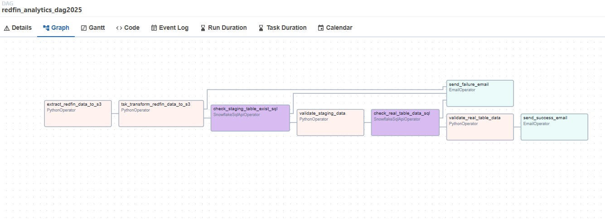

# AWS, Docker, Airflow and Snowflake Elt 

# Objective
To create a robust ETL pipeline that extracts data from various sources, transforms it according to business rules, and loads it into Snowflake for efficient analytics and reporting.

## Components

### AWS (Amazon Web Services)
- **S3 (Simple Storage Service)**: Used for storing raw data files that are ingested from various sources.

### Docker
- **Containerization**: Docker containers are used to standardize the development environment, ensuring consistency across different stages of development and deployment. All ETL components, including data extraction scripts and transformation logic, are containerized.

### Airflow
- **Workflow Orchestration**: Apache Airflow is used to schedule, manage, and monitor the ETL workflow. It handles dependencies between tasks, retries on failure, and provides a visual representation of the workflow.
- **DAGs (Directed Acyclic Graphs)**: Define the sequence of tasks in the ETL process, ensuring that tasks are executed in the correct order.

### Snowflake
- **Data Warehouse**: Snowflake is the target data warehouse where the transformed data is loaded. Its scalable architecture allows for efficient storage and querying of large datasets.
- **Data Transformation**: SQL-based transformations are applied to the data before it is loaded into Snowflake tables.

## ETL Process

### Data Extraction
1. Data is extracted from various sources such as zip files.
2. Raw data is stored in AWS S3 for temporary storage.

### Data Transformation
1. Docker containers run transformation scripts that clean and standardize the data.
2. Data is then transferred to AWS S3 clean bucket for more complex transformations and aggregations.

### Data Loading
1. Transformed data is loaded from AWS S3 into Snowflake using Snowflake's data loading capabilities.
2. Data is organized into Snowflake tables, ready for querying and analysis.

### Workflow Management
1. Airflow orchestrates the entire ETL process, ensuring tasks are executed in the correct order and monitoring the workflow for any failures.
2. Airflow DAGs manage task dependencies, retries, and scheduling.

## Images

